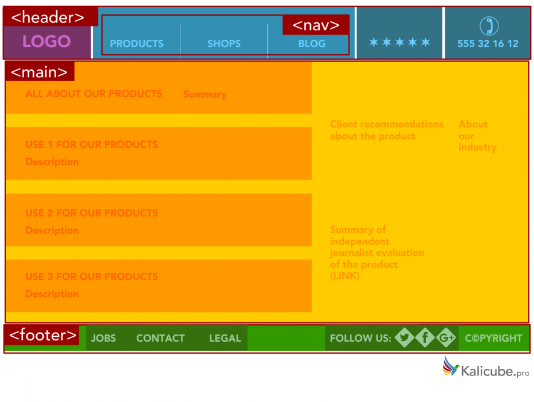

### Что такое семантика HTML5?

Если вы немного знаете HTML5, то вы знаете что HTML тэги (в основном) используются для форматирования контента, т.е. эти тэги говорят браузеру как отобразить содержимое на странице. Они не дают никаких указаний относительно того, какой контент они содержат или какую роль играет контент на странице.

Семантика HTML5 устраняет этот недостаток путем определения специфических тегов, чтобы четко указать, какую роль играет контент содержащийся в этих тегах. Эта явная информация помогает роботам/поисковикам, таким как Google и Bing, лучше понимать какой контент важен, какой вторичен, что используется для навигации и т.д. Добавляя семантические HTML теги на вашу страницу, вы предоставляете дополнительную информацию, которая поможет Google и Bing понимать роли и относительную важность различных частей страницы.

**Например**

_теги div и span. Не семантические/общие._

Это пример несемантических HTML элементов. Они служат только в качестве тегов, которые передают браузеру информацию о том как отобразить контент. Они не дают информации о том какую роль играет их содержимое на странице.

_Примеры семантических тегов._

Это семантические элементы. Они четко определяют роль контента, который содержат.

### Почему мне нужно это использовать?

Для зрячих пользователей, как правило, легко определить различные части веб страницы с первого взгляда. Заголовки, меню и (возможно) основной контент, все сразу визуально очевидно. Теперь представьте что вы слепы.

Боты Google и Bing, если и не слепы, то с серьезно нарушенным зрением. Для них визуальные подсказки невероятно сложно заметить и понять.

Им нужна помощь. Если вы хотите успешно взаимодействовать с Google и Bing, укажите какая часть страницы является хедером, какая футером и какая навигацией, они будут вам благодарны. Самое главное, сообщая им, что является наиболее значимым контентом, вы даете явную инструкцию по приоритетам у контента.

Само по себе использование семантического HTML5 не вызовет SEO революцию (извините!). Как вы знаете, успешное SEO - это совокупность очень многих деталей. В данном случае, это одна из тем мелких деталей, которые улучшают понимание Google и Bing (и уверенность в их понимании) вашего контента, и это поможет в вашем SEO продвижении.

Смотря вперед, как развивается SEO в ближайшие годы, явная и последовательная связь с этими поисковиками будет одним из двух краеугольных камней вашей стратегии SEO/AEO.

### На что это похоже?

Примеры семантических HTML тегов включают `<nav>`, `<footer>` и `<section>`. Есть еще много семантических тегов HTML5 которые могут быть использованы (например `<blockquote>` и `<em>`), но в данной статье я смотрю только на эти семантические HTML теги, которыми вам нужно будет разделить содержимое страницы на ее основные части.

Следующие HTML5 теги могут быть использованы вместо тегов `
`, чтобы разделить содержимое вашей страницы по определенным частям, каждая из которых выполняет определенную роль. Как вы можете себе представить, такие поисковики как Google и Bing любят это.

Это строгое разграничение и явное присвоение ролей каждой части контента делает страницу гораздо понятнее и проще для корректного индексирования Google и Bing.

Поскольку все эти теги ведут себя точно так же, как теги `
`, они могут просто заменить существующие `
` на странице, не влияя на на макет. Во многих случаях реализовать семантический HTML5 может быть так же просто, как найти правильные пары `
..
` и заменить их.

**Лучше иметь супер простую реализацию, которая 100% верна, чем сложную, которая является неправильной.**

Ошибочная реализация посылает противоречивые и запутанные сигналы, которые сделают вещи хуже, а не лучше.

Простая и корректная реализация уже является большим шагом вперед в вашем общении с Google и Bing. Не будьте слишком амбициозны: поймите это неправильно и вы можете создать больше проблем, чем решить!

### Более сложные примеры

**Использование секций и артиклей**

Здесь мы сделали иерархию в рамках нашего основного контента. Существует всеохватывающая статья которая идентифицирует центральный контент в теге `<main>`. Это дает обзор темы этой части страницы. В этой статье у нас есть несколько подразделов, которые развивают основную тему, которая определяется вложенными разделами.

**Обратите внимание, что дизайн (оранжевые блоки) не используется для определения семантических областей страницы. Выглядит немного запутанным, но хорошо показывает что макет HTML и семантический HTML5 имеют разные роли.**

В реальном мире семантическая разметка часто следует за макетом больше чем этот пример. Главное правило: <section> является частью чего-то другого, а `<article>` самостоятелен.

Также обратите внимание, что здесь я добавил раздел навигации в футере. Логически, как и хедер, футер содержит навигационные элементы.

**Связанные** `<aside>` **блоки**

Здесь мы добавили две части непосредственно связанного контента к основной статье. Используя `<aside>`, мы указываем что связанный контент (aside) является необязательным. Основной контент может быть показан без `<aside>` и по-прежнему пониматься.

**Косвенно связанные** `<aside>` **блоки**

**Обратите внимание:** в стороне не обязательно должна быть боковая панель рядом с основным контентом. Она так же может быть использована для блоков ниже основного контента, содержать заголовок, текст и ссылки на другие страницы.

Здесь мы определили некоторые косвенно связанные материалы на странице, за пределами основной статьи. Здесь мы указываем что содержимое в тегах `<aside>` не имеет прямого отношения к основной статье.

**_Этого достаточно для большинства нужд._**

### Наша финальная версия

### Полезные советы

**<section> против <article>**

Об этом много говорят. Нет фиксированного правила о секциях и артиклях и их реализация довольно гибка. Они более или менее одинаковы и взаимозаменяемы в большинстве случаев. Просто будьте логичны и последовательны.

**Личный совет:** я обнаружил, что вложенность `<section>` внутри `<article>` логична как для человека, так и для машины (HTML код будет легче читать разработчику).

**Вложенные элементы**

Элементы могут содержать другие элементы. Например, `<article>` может иметь свои собственные `<header>`, `<footer>`, `<h1>` (как видно выше) и даже `<nav>` (якорные ссылки являются хорошим примером). Я не привел иллюстрацию этой "супер вложенности" и для этого есть причина: это SEO-блог и с точки зрения SEO нет реальной выгоды от продвижения логики семантического HTML5.

**Как упоминалось выше, для SEO целей, вы должны сосредоточится на предоставлении прочной, простой структуры.**

### Что НЕ СТОИТ делать

Просто предупреждение - я видел много сайтов, использующих визуальный дизайн в качестве руководства для их реализации HTML5. Как говорилось выше, это не то, для чего предназначен семантический HTML5.

Этот (удивительно типичный) пример просто дублирует визуальный макет. Это бессмысленно, так как указывает на то, что страница содержит 4 разные темы, а не одну тему и 3 подтемы. Явное предоставление поисковикам вводящей в заблуждение информации окажет негативное влияние на ее понимание.

Внедрение семантического HTML5 на ваших страницах улучшит ваше взаимодействие с Google и Bing. Они оба хотят понять о чем ваш сайт. Они оба хотят, чтобы вы точно общались на их языке и чтобы вы их обучали. Сделайте это!

_Оригинальная статья: [HTML5 Semantic Tags: What They Are and How to Use Them!](https://www.semrush.com/blog/semantic-html5-guide/)_
