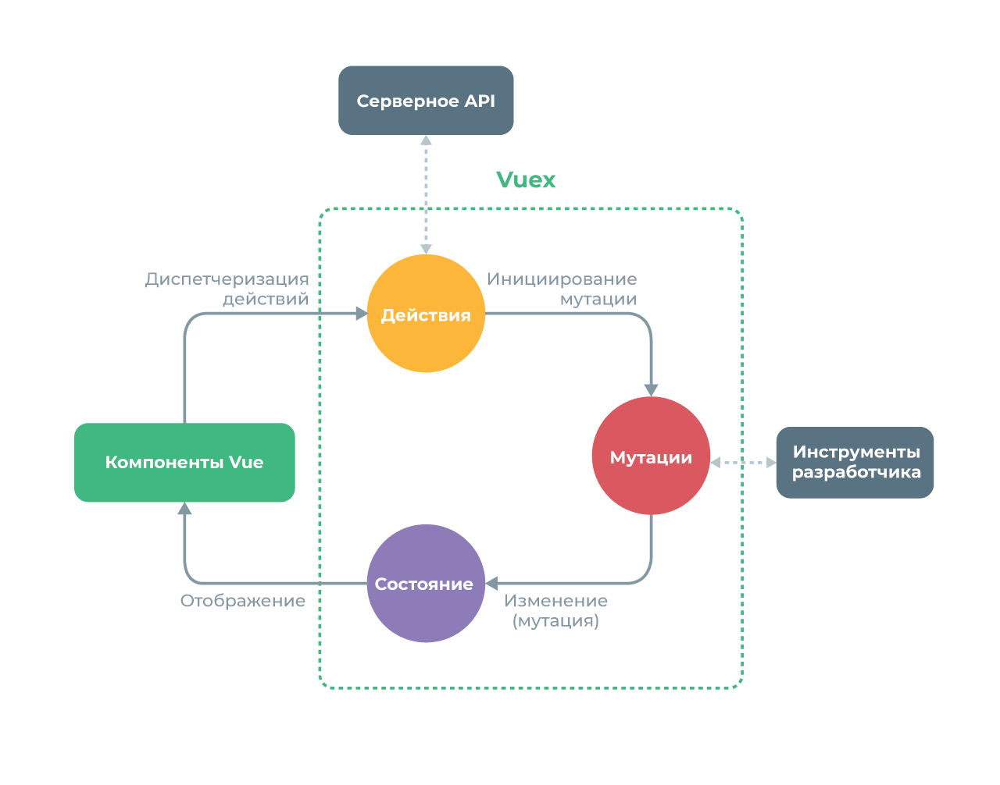

> В последнее время Typescript становится наиболее популярным в экосистеме Javascript и в данном посте я не хочу глубоко погружаться в Typescript, но мне бы хотелось показать базовые принципы интеграции Vuex во Vue приложении с кодовой базой Typescript.

На данном этапе, я предполагаю, что вы знакомы с базовыми понятиями Typescript и тем как использовать язык во Vue приложении. Если вы хотите взглянуть на базовый пример с TS, я предлагаю посмотреть этот репозиторий:
[GitHub - microsoft/TypeScript-Vue-Starter: A starter template for TypeScript and Vue with a detailed README describing how to use the two together.](https://github.com/Microsoft/TypeScript-Vue-Starter)

Согласно официальной документации, Vuex определяется следующим образом:

> Vuex - это шаблон управления состоянием + библиотека для Vue.js приложения. Он служит центральным хранилищем для всех компонентов в приложении, с набором правил, гарантирующих, что состояние может быть изменено только предсказуемым способом.



Так как у меня был большой опыт работы с Flux и Redux, данная концепция не открыла для меня чего-то нового, так что если вы знакомы с этой схемой, это не должно вызвать у вас больших трудностей при использовании Vuex.

По моему мнению, данный паттерн реально полезен когда вы имеете дело с приложением, в котором необходимо масштабирование и повышение общей производительности.

---

Но вернемся к теме, как нам объединить Vuex с Typescript?

```typescript
// index.ts
import Vue from 'vue';
import Vuex, { StoreOptions } from 'vuex';
import { RootState } from './types';
import { profile } from './profile/index';

Vue.use(Vuex);

const store: StoreOptions<RootState> = {
  state: {
    version: '1.0.0' // a simple property
  },
  modules: {
    profile
  }
};

export default new Vuex.Store<RootState>(store);
```

И *types.ts*:

```typescript
// types.ts
export interface RootState {
  version: string;
}
```

Этот код очень похож на стандартный подход к созданию хранилища Vuex, но вы можете заметить здесь несколько различий:

- `store` создается с помощью типа `StoreOptions` и определяетcя общим типом `RootState` (который в свою очередь определяет тип корневого стейта)
- `new Vuex.State` так же использует `RootState`

Благодаря этому, мы явно определяем типы для корневого экземпляра Vue.

Как обычно, я предлагаю и рекомендую использовать модульный подход, потому что появляется много преимуществ при подключении Vuex к нескольким компонентам, поэтому я создал хранилище с простым базовым модулем: **_Profile_**.

```typescript
// profile/index.ts
import { Module } from 'vuex';
import { getters } from './getters';
import { actions } from './actions';
import { mutations } from './mutations';
import { ProfileState } from './types';
import { RootState } from '../types';

export const state: ProfileState = {
  user: undefined,
  error: false
};

const namespaced: boolean = true;

export const profile: Module<ProfileState, RootState> = {
  namespaced,
  state,
  getters,
  actions,
  mutations
};
```

И *types.ts*:

```typescript
// types.ts
export interface User {
  firstName: string;
  lastName: string;
  email: string;
  phone?: string;
}

export interface ProfileState {
  user?: User;
  error: boolean;
}
```

Глядя на файл index.ts, вы можете заметить несколько вещей:

- Стейт начинает инициализироваться с типом `ProfileState`
- Созданный и экспортированный на данном этапе модуль немного сложнее: это `Module` определенный несколькими типами: `ProfileState` (является типом стейта модуля) и `RootState` (корневой стейт для хранилища Vuex)

`Module` - это тип определенный во Vuex:

```typescript
// vuex/types/index.d.ts
export interface Module<S, R> {
  namespaced?: boolean;
  state?: S | (() => S);
  getters?: GetterTree<S, R>;
  actions?: ActionTree<S, R>;
  mutations?: MutationTree<S>;
  modules?: ModuleTree<R>;
}
```

Глядя на данный интерфейс, `Module` представляет собой простой объект, агрегирующий (опционально) переданные действия/мутации/геттеры/стэйт и внутренние модули.

Давайте на примере разберем действия.

_Actions.ts_:

```typescript
// profile/actions.ts
import { ActionTree } from 'vuex';
import axios from 'axios';
import { ProfileState, User } from './types';
import { RootState } from '../types';

export const actions: ActionTree<ProfileState, RootState> = {
  fetchData({ commit }): any {
    axios({
      url: 'https://....'
    }).then(
      (response) => {
        const payload: User = response && response.data;
        commit('profileLoaded', payload);
      },
      (error) => {
        console.log(error);
        commit('profileError');
      }
    );
  }
};
```

Чтобы экспортировать что-то ожидаемое типом Vuex'`Module` , нам нужно объединить наши действия в `ActionTree` , тип определенный во Vuex следующим образом:

```typescript
// vuex/types/index.d.ts
export interface ActionTree<S, R> {
  [key: string]: Action<S, R>;
}
```

Не составляет труда понять, что это представляет собой объект ожидающий некоторые ключи, имена экшнов, и `Action` ассоциации (по прежнему ожидающие типы Module State и Root State).

В нашем случае, мы имеем просто `ActionTree` содержащий простое действие `fetchData` , которое выполняет асинхронную задачу (получает некоторые данные из сервиса) и коммитит успех или ошибку, полагаясь на ответ сервера. Полезная нагрузка коммита, в данном случае успеха, типизирована в `User`.

Давайте посмотрим на мутации:

_Mutations.ts_:

```typescript
// profile/mutations.ts
import { MutationTree } from 'vuex';
import { ProfileState, User } from './types';

export const mutations: MutationTree<ProfileState> = {
  profileLoaded(state, payload: User) {
    state.error = false;
    state.user = payload;
  },
  profileError(state) {
    state.error = true;
    state.user = undefined;
  }
};
```

Мутации следуют тем же подходам, что мы обсуждали для Действий и ожидают переменную типа `MutationTree` определенную во Vuex следующим образом:

```typescript
// vuex/types/index.d.ts
export interface MutationTree<S> {
  [key: string]: Mutation<S>;
}
```

Завершая инициализацию модуля, мы так же выставляем нужные нам геттеры. В нашем случае это простой геттер возвращающий полное имя выбранных пользователей, комбинируя свойства хранилища `firstName` и `lastName` .

Да, вы можете сделать это с помощью класса для `User`, но я хотел бы иметь базовый пример для геттеров.

_Getters.ts_:

```typescript
// profile/getters.ts
import { GetterTree } from 'vuex';
import { ProfileState } from './types';
import { RootState } from '../types';

export const getters: GetterTree<ProfileState, RootState> = {
  fullName(state): string {
    const { user } = state;
    const firstName = (user && user.firstName) || '';
    const lastName = (user && user.lastName) || '';
    return `${firstName} ${lastName}`;
  }
};
```

`GetterTree` определен во Vuex следующим образом:

```typescript
// vuex/types/index.d.ts
export interface GetterTree<S, R> {
  [key: string]: Getter<S, R>;
}
```

---

Теперь самое интересное: как нам все это подключить во Vue компонент?

Для следующего примера я использую [vuex-class](https://github.com/ktsn/vuex-class), чтобы подключить простой компонент к Vuex.

```markup
<template>
  <div class="container">
    <div v-if="profile.user">
      <p>
        Full name: {{ fullName }}
      </p>
      <p>
        Email: {{ email }}
      </p>
    </div>
    <div v-if="profile.error">
      Oops an error occured
    </div>
  </div>
</template>

<script lang="ts">
import Vue from "vue";
import { State, Action, Getter } from "vuex-class";
import Component from "vue-class-component";
import { ProfileState, User } from "./store/profile/types";
const namespace: string = "profile";
@Component
export default class UserDetail extends Vue {
  @State("profile")
  profile: ProfileState;
  @Action("fetchData", { namespace })
  fetchData: any;
  @Getter("fullName", { namespace })
  fullName: string;

  mounted() {
    // получение данных после монтирования компонента
    this.fetchData();
  }

  // вычисляемое свойство email пользователя
  get email() {
    const user = this.profile && this.profile.user;
    return (user && user.email) || "";
  }
}
</script>
```

Пример выше - это базовый сингл файл компонент, содержащий `template` (с жесткой логикой отображения первой секции когда определенное условие возвращает истину) и `script` описывающий поведение нашего компонента. В данном примере я так же использую [vue-class-component](https://github.com/vuejs/vue-class-component), чтобы использовать синтаксис основанный на классах (vuex-class так же зависит от этого модуля).

Благодаря **Vuex-class**, возможно использовать декораторы, чтобы получить все что нам нужно: State, Actions, Mutations, Getters и обертку `namespace`.

Наш компонент будет иметь несколько вычисляемых свойств, одно называется `profile` и относится к стейту `Profile`, а второе ссылается на `getter` который мы определили в модуле.
Данный пример использует два декоратора предоставляемых vuex-class: State и Getter. Для доступа к нужному модулю, объект (или *BindingOptions*) со свойством `namespace` передается вторым параметром.

```typescript
@State('profile') profile: ProfileState;
@Getter('fullName', { namespace }) fullName: string;
```

В нашем случае нам нужно описать экшн `fetchData` с помощью декоратора `Action`:

```typescript
@Action('fetchData', { namespace }) fetchData: any;
```

и вызвать его в колбеке `mounted` жизненного цикла компонента

```typescript
mounted() {
  // получение данных после монтирования компонента
  this.fetchData();
}
```

Чтобы отрендерить что-то осмысленное, часть шаблона использует ранее объявленные геттеры для отображения `fullName` и базовое вычисляемое свойство, чтобы отобразить `email` пользователя.

```markup
<p>
  Full name: {{ fullName }}
</p>
<p>
  Email: {{ email }}
</p>
```

---

Это основы. Существуют другие способы взаимодействия Vue компонента с Vuex, но я считаю что это неплохой способ начать работать с typescript.

Конечно, существует много возможностей для улучшения в данном примере/коде, например, улучшение типизации кода, с целью получения более надежной логики или улучшения визуализации изменений модуля.

Надеюсь, данная статья вам понравилась!

_Оригинальная статья: https://codeburst.io/vuex-and-typescript-3427ba78cfa8_
